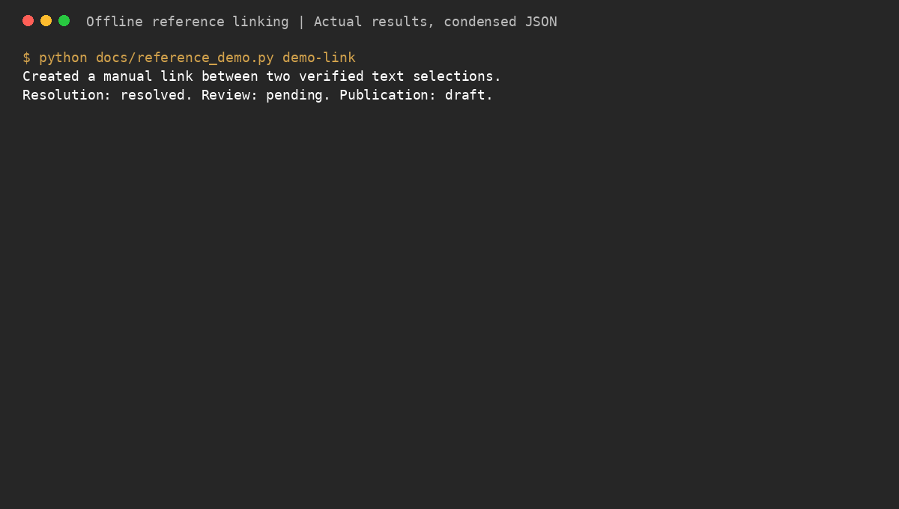

# Reference linking in the CLI and Homebrew tap

The released Homebrew CLI includes two **offline** commands:

```bash
corpora references check reference.json
corpora references retrieve endpoint.json --snapshot snapshot.json
```

`check` validates the public Reference model and returns JSON with the same ID.
It does not validate target existence, approve a link, or publish it. `retrieve`
requires exactly one text locator and a full trusted TextSnapshot. It verifies
work/edition/package/revision/document, stream, Unicode-scalar half-open offsets,
exact quote and surrounding context. A stale/missing selection exits 1 with no
stdout; malformed inputs, unsupported selectors or missing core exit 2.
Successful output is JSON: `{"text":"Selected words"}`. It never relocates a
quote, guesses a work, calls Supabase, or writes a document.

The snapshot and immutable identity come from your trusted extraction/inventory
provider. An arbitrary file claiming a revision is not independently proven
original-file evidence. Native PDF/EPUB/HTML selection adapters and authenticated
review belong to the Python service, outside these offline commands.

## Availability

Homebrew CLI v2.2.0 ships these commands and depends directly on the independently
published `corpora-linking>=0.1.0,<0.2`. `uv sync` installs the core from PyPI;
no local core source or unpublished umbrella package is needed.

Normal CLI commands and `references --help` import the core lazily; a broken
installation reports the dependency to reinstall. Reference tests now require
the dependency and fail rather than silently skipping when it is missing.

Example snapshot (synthetic text and IDs):

```json
{"endpoint":{"work_id":"book","edition_id":"edition","package_id":"pkg","revision":"rev1","document_id":"d","locators":[]},"stream_id":"body","text":"Before. Linked words. After."}
```

Matching endpoint:

```json
{"work_id":"book","edition_id":"edition","package_id":"pkg","revision":"rev1","document_id":"d","locators":[{"kind":"text","stream_id":"body","start":8,"end":20,"exact":"Linked words","prefix":"Before. ","suffix":". After.","normalization":"preserve"}]}
```

## Release sequence

1. Verify CLI tests and the installed CLI wheel against the released core.
2. Release the CLI through dev → next → release → main with a new VERSION.
3. The release workflow requests the formula bump for the actual **CLI tag**. It
   calculates the tarball checksum and updates Formula/cli.rb on main.
4. The bump workflow validates the updated main formula on macOS. Its test
   retrieves an exact selection through the installed CLI and rejects a stale
   revision, alongside the existing conversion/validation round trip.

The corpora-py dependency floor remains unchanged: these offline commands use
the standalone core directly and do not require an authenticated API. Format adapters, persistent review and the API remain Corpora services.
No fabricated package version or release checksum is used.

Homebrew tooling is unavailable in this execution workspace; local Python
checks do not establish a successful brew installation. GitHub resolves the old
exegia/corpora-cli name to exegia/homebrew-corpora; maintain changes here once.

## Create a link and try retrieval



From this checkout, install dependencies with `uv sync`, then run:

```bash
# Use a fresh directory: the example refuses to replace an existing stable ID.
uv run python docs/reference_demo.py demo-link
uv run corpora references check demo-link/reference.json
uv run corpora references retrieve demo-link/target.json \
  --snapshot demo-link/target-snapshot.json
```

The Python example creates a manual link from a selected sentence in a reader’s
notes to a passage in another work. It verifies both quotes against their pinned
snapshots and saves the reference plus both endpoints. The target contains an
emoji, demonstrating that offsets count Unicode scalars rather than UTF-16 units.
Quotes that occur more than once are rejected instead of picking the first.

Retrieval prints:

```json
{"text": "Love your neighbor as yourself."}
```

The link is resolved, pending review, and draft. Local creation does not approve
it, upload it, or publish it into C-USX. The sample hashes its synthetic text
streams to distinguish versions; this is not original PDF/EPUB/HTML evidence.
No paragraph IDs or sentence numbering are required.

Try the same selection against the revised snapshot:

```bash
uv run corpora references retrieve demo-link/target.json \
  --snapshot demo-link/stale-snapshot.json
```

It exits 1 with no selected text on stdout, even though the quote still appears
in the new version. Nothing is silently relocated.

### Development CLI creation interface

**Implemented on this feature branch; requires the next CLI release.** Selection
is separate from linking so each step has a clear input and validation boundary:

```bash
corpora references select --snapshot demo-link/source-snapshot.json \
  --quote "Love your neighbor." -o demo-link/cli-source.json
corpora references select --snapshot demo-link/target-snapshot.json \
  --quote "Love your neighbor as yourself." -o demo-link/cli-target.json
corpora references create --source demo-link/cli-source.json --target demo-link/cli-target.json \
  --source-snapshot demo-link/source-snapshot.json \
  --target-snapshot demo-link/target-snapshot.json \
  --relationship core:related --creator local-reader -o demo-link/cli-reference.json
```

A repeated quote requires explicit zero-based, half-open `--start` / `--end`
bounds in the named stream. Offsets count Unicode scalars using the snapshot’s
normalization policy. Creation verifies selected source/target text against their
snapshots, preserves a stable ID, and leaves review pending and publication draft.
A whole-work target needs no locator or target snapshot; its identity is retained
as unresolved because this offline command has no catalog authority. Scripture
and native-format targets likewise remain unresolved for the service to verify.
Existing output files are refused, so another invocation cannot replace a link ID.

### C-USX direction

The released CLI converter still outputs `.corpus`. Corpora’s Python integration
can bind anchors and export approved links into supplied C-USX XML. General
source-document-to-C-USX conversion is being added separately; naming an output
file `.cusx` does not make a corpus archive into C-USX.

Working references remain database-authoritative; approved C-USX exports carry
matching IDs. Native-format adapters, review, permissions and synchronization
belong to the service integration, outside these offline commands.

### Re-record the GIF

```bash
uv run --with pillow python docs/record_reference_demo.py
```

The recorder executes the actual example and CLI, verifies outputs and exit
codes, and renders captured command results into a GIF plus a text transcript.
Pillow is a documentation-only rendering dependency.
